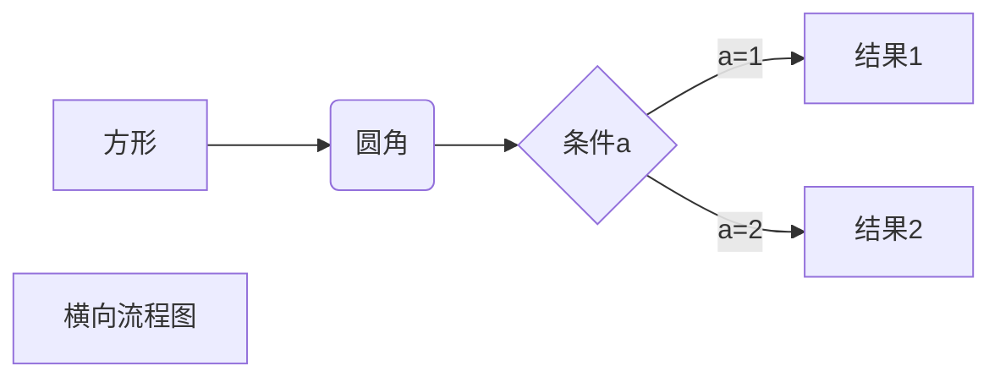
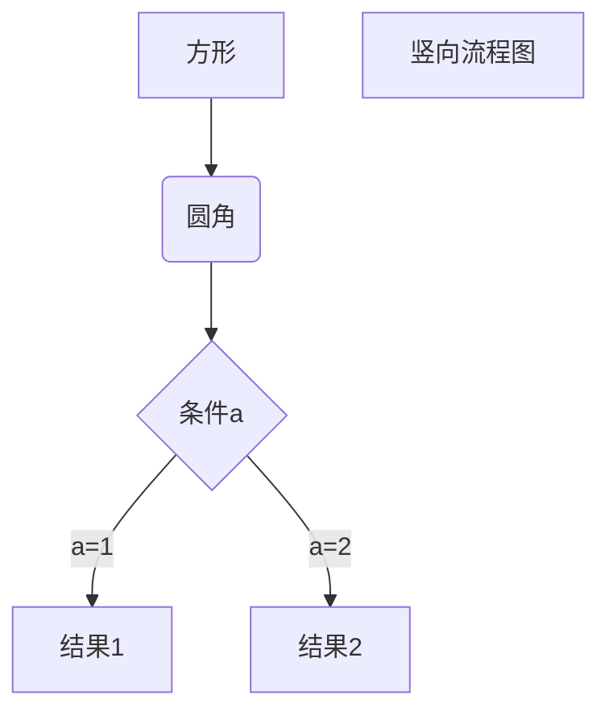
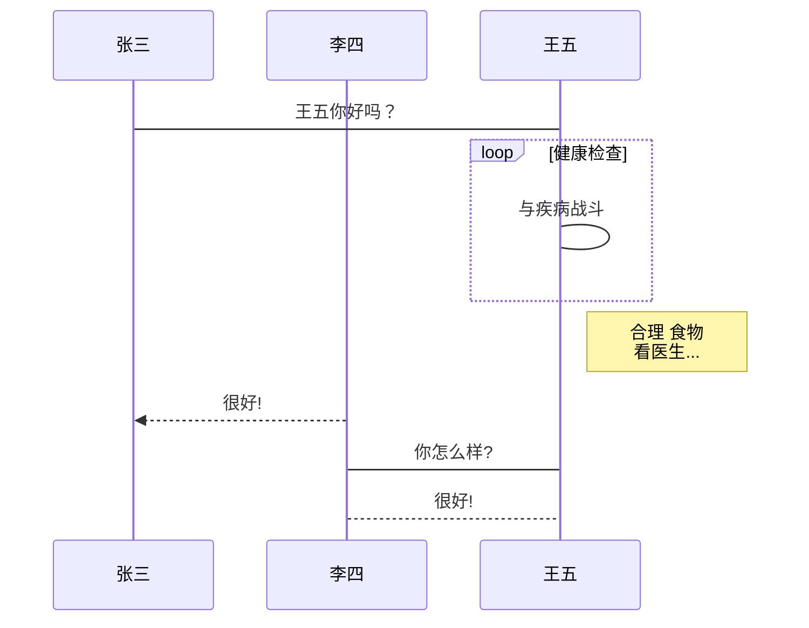
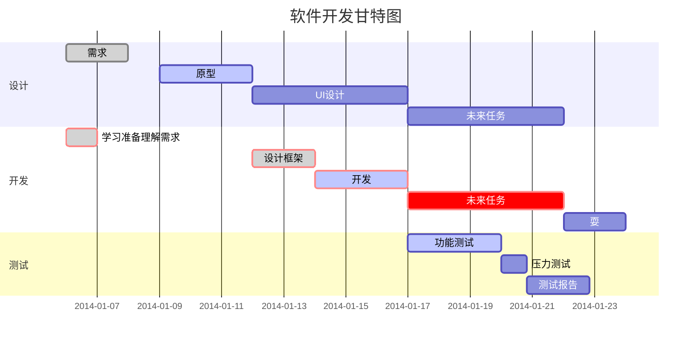

https://www.jianshu.com/p/05d808b3ede4  
# markdown编写规范  
##Markdown 标题
    # 一级标题  
    ## 二级标题  
    ### 三级标题  
    #### 四级标题  
    ##### 五级标题  
    ###### 六级标题  
    
## Markdown 段落样式
### 段落
* Markdown 段落没有特殊的格式，直接编写文字就好，段落的换行是使用两个以上空格加上回车。  
``````
hang1  
hang2
``````
  
* 也可以在段落后面使用一个空行来表示重新开始一个段落.
``````
hang1

hang2 
``````
### Markdown字体
Markdown 可以使用以下几种字体：

    *斜体文本*  
    _斜体文本_  
    **粗体文本**  
    __粗体文本__  
    ***粗斜体文本***  
    ___粗斜体文本___  

###分隔线
你可以在一行中用三个以上的星号、减号、下划线来建立一个分隔线，行内不能有其他东西。你也可以在星号或是减号中间插入空格。下面每种写法都可以建立分隔线：
``````
    ***  
    * * *  
    ******  
    ---  
    ------  
    ______ 
`````` 
效果如下
***  
* * *  
******  

---  
------  
 ______  
###删除线
如果段落上的文字要添加删除线，只需要在文字的两端加上两个波浪线 ~~ 即可，实例如下：  
``````
RUNOOB.COM  
GOOGLE.COM  
~~BAIDU.COM~~  
``````
效果如下：  
RUNOOB.COM  
GOOGLE.COM  
~~BAIDU.COM~~  

###下划线
下划线可以通过 HTML 的 \<u\> 标签来实现：  
``````
<u>带下划线文本</u>
``````
效果如下：  
<u>带下划线文本</u>  

## Markdown 列表
Markdown 支持有序列表和无序列表。
### 无序列表
无序列表使用星号(*)、加号(+)或是减号(-)作为列表标记：  
```
* 第一项
* 第二项
* 第三项

+ 第一项
+ 第二项
+ 第三项


- 第一项
- 第二项
- 第三项
```
效果如下：  
* 第一项
* 第二项
* 第三项

+ 第一项
+ 第二项
+ 第三项


- 第一项
- 第二项
- 第三项  


### 有序列表
有序列表使用数字并加上 . 号来表示，如：
```
1. 第一项
2. 第二项
3. 第三项
```
效果如下：
1. 第一项
2. 第二项
3. 第三项
### 列表嵌套
```
1. 第一项：
    - 第一项嵌套的第一个元素
    - 第一项嵌套的第二个元素
2. 第二项：
    - 第二项嵌套的第一个元素
    - 第二项嵌套的第二个元素
```
效果如下：
1. 第一项：
    - 第一项嵌套的第一个元素
    - 第一项嵌套的第二个元素
2. 第二项：
    - 第二项嵌套的第一个元素
    - 第二项嵌套的第二个元素
    
## Markdown 区块
Markdown 区块引用是在段落开头使用 > 符号 ，然后后面紧跟一个空格符号：
```
> 区块引用
> 菜鸟教程
> 学的不仅是技术更是梦想
```
效果如下：
> 区块引用  
> 菜鸟教程  
> 学的不仅是技术更是梦想  

另外区块是可以嵌套的，一个 > 符号是最外层，两个 > 符号是第一层嵌套，以此类推退：
```
> 最外层
> > 第一层嵌套
> > > 第二层嵌套
```
效果如下：
> 最外层
> > 第一层嵌套
> > > 第二层嵌套

区块中使用列表
```
> 区块中使用列表
> 1. 第一项
> 2. 第二项
> + 第一项
> + 第二项
> + 第三项
```
效果如下：  
> 区块中使用列表
> 1. 第一项
> 2. 第二项
>> + 第一项
>> + 第二项
>> + 第三项


###列表中使用区块
如果要在列表项目内放进区块，那么就需要在 > 前添加四个空格的缩进。

区块中使用列表实例如下：

```
* 第一项
    > 菜鸟教程
    > 学的不仅是技术更是梦想
* 第二项
```
效果如下:  
* 第一项
    > 菜鸟教程
    > 学的不仅是技术更是梦想
* 第二项

## Markdown 代码
### 段落中使用代码块
如果是段落上的一个函数或片段的代码可以用反引号把它包起来（\`），例如:  
```
`printf()` 函数

```
效果如下:  
`printf()` 函数

###代码区块
代码区块使用 4 个空格或者一个制表符（Tab 键）。  

你也可以用 ``` 包裹一段代码，并指定一种语言（也可以不指定）：

## Markdown 链接
链接使用方法如下：  
```
[链接名称](链接地址)
或者
<链接地址>
```

## Markdown 图片
Markdown 图片语法格式如下：
```


```
开头一个感叹号 !  
接着一个方括号，里面放上图片的替代文字  
接着一个普通括号，里面放上图片的网址，最后还可以用引号包住并加上选择性的 'title' 属性的文字。  
实例：  


## Markdown 表格
Markdown 制作表格使用 | 来分隔不同的单元格，使用 - 来分隔表头和其他行。

* 语法格式如下：
```
|  表头   | 表头  |
|  ----  | ----  |
| 单元格  | 单元格 |
| 单元格  | 单元格 |
```
效果如下：  
|  表头   | 表头  |  
|  ----  | ----  |  
| 单元格  | 单元格 |   
| 单元格  | 单元格 |  

* 对齐方式

我们可以设置表格的对齐方式：  
-: 设置内容和标题栏居右对齐。  
:- 设置内容和标题栏居左对齐。  
:-: 设置内容和标题栏居中对齐。  
实例如下：  
| 左对齐 | 右对齐 | 居中对齐 |  
| :-----| ----: | :----: |  
| 单元格 | 单元格 | 单元格 |  
| 单元格 | 单元格 | 单元格 |  


## Markdown 高级技巧
###支持的 HTML 元素
不在 Markdown 涵盖范围之内的标签，都可以直接在文档里面用 HTML 撰写。

目前支持的 HTML 元素有：\<kbd\> \<b\> \<i\> \<em\> \<sup\> \<sub\> \<br\>等 ，如：

使用 ```<kbd>Ctrl</kbd>+<kbd>Alt</kbd>+<kbd>Del</kbd>``` 重启电脑
输出结果为：  
<kbd>Ctrl</kbd>+<kbd>Alt</kbd>+<kbd>Del</kbd>

### 转义
Markdown 使用了很多特殊符号来表示特定的意义，如果需要显示特定的符号则需要使用转义字符，Markdown 使用反斜杠转义特殊字符
1、横向流程图源码格式：


2、竖向流程图源码格式：


3、标准流程图源码格式：

```flow
st=>start: 开始框
op=>operation: 处理框
cond=>condition: 判断框(是或否?)
sub1=>subroutine: 子流程
io=>inputoutput: 输入输出框
e=>end: 结束框
st->op->cond
cond(yes)->io->e
cond(no)->sub1(right)->op
```
4、标准流程图源码格式（横向）：

```flow
st=>start: 开始框
op=>operation: 处理框
cond=>condition: 判断框(是或否?)
sub1=>subroutine: 子流程
io=>inputoutput: 输入输出框
e=>end: 结束框
st(right)->op(right)->cond
cond(yes)->io(bottom)->e
cond(no)->sub1(right)->op
```
5、UML时序图源码样例：

```sequence
对象A->对象B: 对象B你好吗?（请求）
Note right of 对象B: 对象B的描述
Note left of 对象A: 对象A的描述(提示)
对象B-->对象A: 我很好(响应)
对象A->对象B: 你真的好吗？
```
6、UML时序图源码复杂样例：

```sequence
Title: 标题：复杂使用
对象A->对象B: 对象B你好吗?（请求）
Note right of 对象B: 对象B的描述
Note left of 对象A: 对象A的描述(提示)
对象B-->对象A: 我很好(响应)
对象B->小三: 你好吗
小三-->>对象A: 对象B找我了
对象A->对象B: 你真的好吗？
Note over 小三,对象B: 我们是朋友
participant C
Note right of C: 没人陪我玩
```
7、UML标准时序图样例：


8、甘特图样例：




